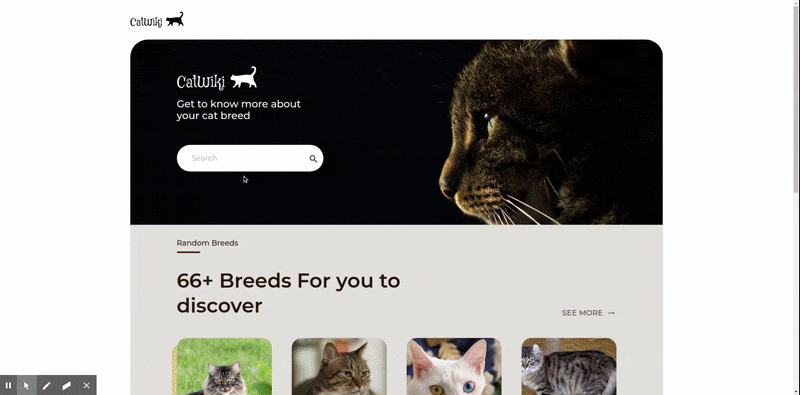

# Overview

This application hosted on [surge](https://catwiki.surge.sh/) and was created as a submission to [challenge](https://devchallenges.io/challenges/f4NJ53rcfgrP6sBMD2jt).

I modified given user stories to focus mostly on front end part using default CatAPI.

## Built With

- [React](https://reactjs.org/)
- [TailwindCSS](https://tailwindcss.com/)

## Contact

All feedback appreciated!

Contact me via [GitHub](https://github.com/endlessqt) or [Twitter](https://twitter.com/endlessqt).
